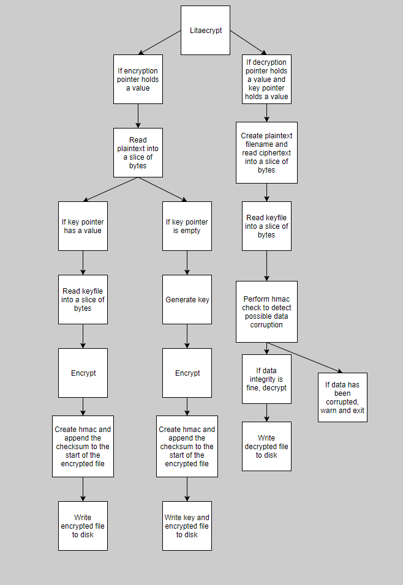

# Encryption Techniques
## Litaecrypt
Matti Ruusupiha  
Mikko Seppänen

## 1	Litaecrypt program documentation
###### 1.1	Authors and version
Matti Ruusupiha & Mikko Seppänen
Version 1.0
###### 1.2	Introduction
In this assignment we decided to make an encryption software with a known vulnerability, explain why it’s vulnerable and how to make it secure. For the programming we used the Go programming language. The program was named Litaecrypt. Litaecrypt is a command line tool for encrypting and decrypting files. It uses 128-bit AES for encryption. Originals of the encrypted files are not deleted. The encrypted files use the .lit -extension. The vulnerability comes from using a cryptographically insecure random function for generating the key, more on the random functions later.
###### 1.3	Installation
Litaecrypt is a standalone program that doesn’t require additional files.
There are binaries for 64 and 32-bit Windows or Linux operating systems.
User simply navigates to the folder where the program file is located with a command prompt
or shell such as PowerShell or Bash and runs the program.  
**(LISÄÄ TÄHÄN DOWNLOAD LINKIT BINÄÄREIHIN)**
###### 1.4	Usage
For file encryption, generating a new key file:
```
litaecrypt -e {filename}
```
For file encryption, using an existing key file:
```
litaecrypt -e {filename} -k {keyfile}
```
For file decryption
```
litaecrypt -d {filename} -k {keyfile}
```
## 2	Architechture of Litaecrypt

###### 2.1 Architecture flowchart


## 3	The vulnerability

###### 3.1 About stateful PRNGs
###### 3.2 Exploiting Litaecrypt
###### 3.2 About cryptographically safe PRNGs
###### 3.4 Fixing the vulnerability

Kerrotaan vulnista
Avainsanoja:
Cryptographically secure pseudorandom number generator (CSPRNG)
Pseudorandom number generator (PRNG), deterministic
/dev/urandom (Linux)
CryptGenRandom API (Windows)
rand.Read and crypto rand.Read
