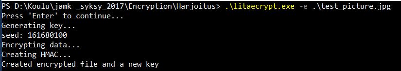
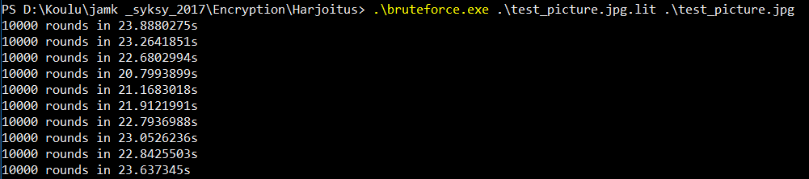

# Encryption Techniques
## Litaecrypt
Matti Ruusupiha  
Mikko Seppänen

## 1	Litaecrypt program documentation
###### 1.1	Authors and version
Matti Ruusupiha & Mikko Seppänen
Version 1.0
###### 1.2	Introduction
In this assignment we decided to make an encryption software with a known vulnerability, explain why it’s vulnerable and how to make it secure. For the programming we used the Go programming language. The program was named Litaecrypt. Litaecrypt is a command line tool for encrypting and decrypting files. It uses 128-bit AES for encryption. Originals of the encrypted files are not deleted. The encrypted files use the .lit -extension. The vulnerability comes from using a cryptographically insecure random function for generating the key, more on the random functions later.
###### 1.3	Installation
Litaecrypt is a standalone program that doesn’t require additional files.
There are binaries for 64 and 32-bit Windows or Linux operating systems.
User simply navigates to the folder where the program file is located with a command prompt
or shell such as PowerShell or Bash and runs the program.  

Download litaecrypt for windows or linux

[For 64-bit linux](litaecrypt_64)  
[For 32-bit linux](litaecrypt_32)  

[For 64-bit windows](litaecrypt_64.exe)  
[For 32-bit windows](litaecrypt_32.exe)  

###### 1.4	Usage
For file encryption, generating a new key file:
```
litaecrypt -e {filename}
```
For file encryption, using an existing key file:
```
litaecrypt -e {filename} -k {keyfile}
```
For file decryption
```
litaecrypt -d {filename} -k {keyfile}
```
## 2	Architechture of Litaecrypt

###### 2.1 Source code

[View Litaecrypt source code](main.go)

###### 2.2 Architecture flowchart


###### 2.3 Functions

**check** is for basic error handling. Logs the error that occured with associated function.  

**stripExtension** removes everything from a string after the "." -character. It's used to convert encrypted files
back to their original form (stripping the .lit -extension).  

**decrypt** takes 2 slices of bytes as arguments, the key and the ciphertext. IV is parsed and used to decrypt the ciphertext together
with the key. Uses golangs in-built functions for AES CFB-mode decryption.

**encrypt** takes 2 slices of bytes as arguments, the key and the plaintext. It uses golangs in-built function to create a new AES
block. 
IV is included in the beginning of the ciphertext and is filled with bytes from either /dev/urandom or CryptGenRandom depending on
the OS used. After that a new AES encrypter running in CFB mode is created and used to encrypt the plaintext. CFB mode was chosen 
arbitrarily, GCM and CTR would have suited our needs also. We have hmac functions separated from the encryption process for data
integrity checking.

**createHmac** takes 2 slices of bytes as arguments, the ciphertext and the AES key. It appends the key to the end of the ciphertext. 
Then it creates a new 256-bit by taking a SHA-256 hash from the original AES key. After that it creates a new hmac_sha256 value
from the ciphertext+key byte slice using the newly created 256-bit key. This value is prepended to the encrypted file.

**checkMac** takes 3 slices of bytes as arguments; the hmac_256 hash parsed from the beginning of the file, the remaining ciphertext and
the AES key. It creates a SHA-256 hash of the AES key, uses that to calculate a new hmac_256 value from the ciphertext and compares
it to the hmac_256 value parsed from the beginning of the encrypted file. If the values match, the encrypted file has remained unchanged.  

**generateKey** seeds the math/rand with time.now.Nanosecond and then reads 16 bytes from math/rands PRNG to generate the 128-bit AES key.

**main** parses the supplied command line flags. If the right flags are specified, main either encrypts with a provided key, encrypts with a
newly geneareted key or decrypts with a provided key.  

Both encrypts follow the same pattern with the exception of key generation. The pattern goes as follows: Read plaintext into a slice of
bytes. Either read a keyfile and transform the hex-encoded string into a slice of bytes, or generate a new key with **generateKey**. Use
**encrypt** to create the ciphertext. Call **createHmac** to generate a new hmac_256 hash and prepend it the ciphertext. Write the ciphertext to
a file called {original file name}.lit. If a new key was generated, write it to a file called key.lit.  

If the decrypt flag is set, the program first calls **stripExtension** to prepare the unencrypted file filename. After that the key is read
from the keyfile and the hex-encoded string is transformed to a slice of bytes. Then **checkMac** is called to verify data integrity. If
the data is intact, **decrypt** is called to decrypt the ciphertext. After that the decrypted bytes are written to a file called {original filename}.  

## 3	The vulnerability

###### 3.1 About stateful PRNGs
Pseudorandom number generators are algorithms that generate a sequence of numbers whose properties only mimics the properties of truly random sequences. The reason why the PRNG doesn’t produce truly random number sequence is that it’s completely determined by the initial value, called seed. The seed determines the initial starting state of PRNG, it can be set to any arbitrary number (often current system time by milliseconds is used). It will always produce the same sequence of numbers when the same state is used to initialize. Therefore if the method of producing the key is known, in the case of Litaecrypt the basic rand() function, the key can be obtained by brute forcing the initial seed, if the plaintext and ciphertext are also known. The Go lang offers two different random function packages, the basic math/rand and crypto/rand. of these two the math/rand is not supposed to be used in cryptographic appliances, as is the case in almost all programming languages basic random functions. They are meant to be fast and used for totally different tasks, but it’s used for this assignment to prove its weakness.  the crypto/rand would make this secure, but more on it later. The seed function which is used to initialize the rand takes its argument modulo 2^31-1, that means that even if the argument would be given as 64-bit integer, only 31 bits are used. That makes it feasible to be brute forced. And there are many common practises that makes the seed even less secure, as is the case in Litaecrypts time.Nanoseconds method.
###### 3.2 Exploiting Litaecrypt
How would one go about exploiting the vulnerability that exist in Litaecrypt then? Earlier we learned, that PRNGs produce always the same number no matter what, if the state of the random number generator stays the same. In Golang, the random number generator is seeded with the integer 1 by default. If math/rand was used as is, it would generate the same key every time. This is not the case with Litaecrypt however, because the imagined developer went through the trouble of seeding rand with a value that changes each time the program is ran. That value is time.Nanosecond, which can be any positive integer between 0 and 999999999. While that is a quite large range of numbers, it is still only 1x10^10 keys compared to AES-128’s 3.4x10^38 keys and is quite bruteforceable.  

We are going to assume the possible attacker has access to the source code of the program. Otherwise the attacker could try to reverse the binaries. After confirming the program uses math/rand seeded with time.Nanosecond, the attacker now needs an encrypted file and corresponding plaintext to perform a known-plaintext attack. In practise the attacker doesn’t actually need to know the full plaintext file. For example, commonly .jpeg files have the bytes 0xFF and 0xD8 at the start of the file, and the bytes 0xFF and 0xD9 at the end of the file. Similar standards exist across other types of files. The attacker needs to get creative and recognize this type of encrypted file that has known properties.  

After encrypted file and the corresponding plaintext has been aquired, the attacker only needs to implement the litaecrypt key generation and decrypt functions, and try to decrypt them with keys generated from random seeds 0-999999999. When the decrypted file matches the plaintext, the key has been found.  

We created a proof-of-concept program in Golang to try the bruteforcing in practise.  

[View Bruteforcer source code](bruteforce.go)

  



Picture: 171KB test_picture.jpg  
Processor: Intel(R) Core(TM) i7-2600K CPU @ 3.40GHz  
Average computing time for 10000 keys: 22,60386205 seconds  
Estimated time to compute all keys: 26 days 3 hours 52 minutes 43 seconds  

[Watch a video of litaecrypt and bruteforce in action](https://silentprocess.github.io/litaecrypt/)  

###### 3.2 About cryptographically safe PRNGs
Cryptographically safe PRNGs or CSPRNGs operate much like the PRNGs, except they are seeded with more unpredictable data and have stricter qualifications for the data they produce. The output bits of a CSPRNG must not be predictable at higher than 50% success rate, and the past or future outputs must not be predictable from the observed outputs.  

On Linux machines, the device /dev/urandom is most often used. It collects a pool of entropy from various hard-to-predict data sources, such as key presses or inter-interrupt timings. This data is then used to seed a ChaCha20-based CRNG, which is essentially a stream
cipher and provides the user with a very large number of cryptographically secure bytes.   

On Windows the standard CSPRNG is the CryptGenRandom handle. Much like /dev/urandom it is initialized with hard-to-predict data from various sources, including but not limited to high-precision performance counters, hash of the users enviroment block and internal
CPU counters. For the PRNG part of the CSPRNG Microsoft uses an "implementation of the AES counter-mode based PRNG specified in NIST Special Publication 800-90".  

These explanations are a simplifications and do not accurately completely describe what goes on in the Linux or Windows kernel. The CSPRNGs described here are accurate for Linux kernels from 4.8 forward and for Windows kernels from Windows Vista SP1 forward at
the time of writing.

###### 3.4 Fixing the vulnerability
Knowing all this, we can deduce that the vulnerability of the program can be fixed by generating the key from cryptographically secure
random numbers. In Golang this is pretty straightforward; replace the math/rand function rand.Read with crypto/rand function rand.Read, which instead of using the languages own PRNG, reads the operating systems CSPRNG. In binaries created for Linux it reads bytes from /dev/urandom, and on Windows it uses the CryptGenRandom API.
